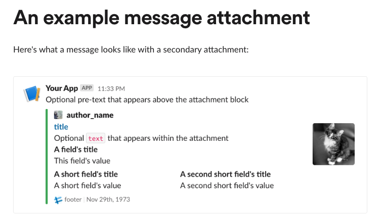
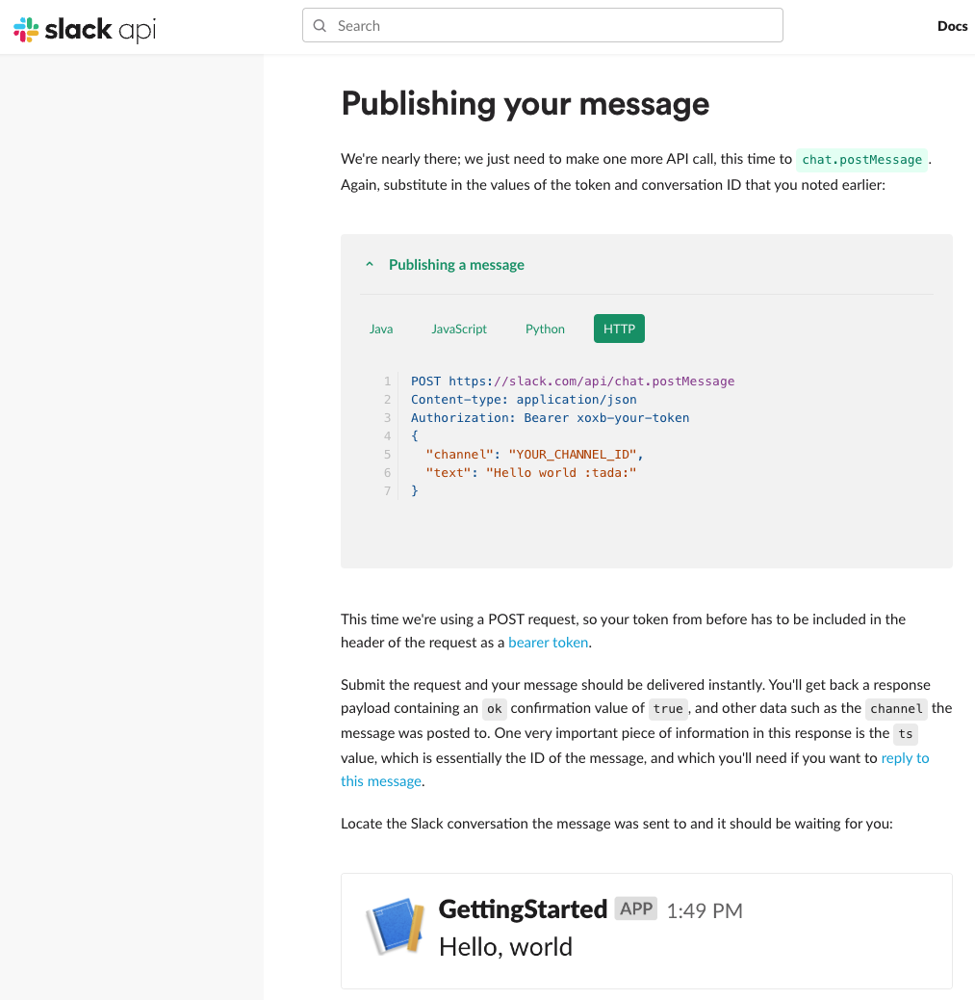

# slack-send
A simple utility to send a Slack message using Slack Web API to your channels


### Usage

```bash
slack-send --help

  -h, --help        (Default: false) Prints this help message.
  -c, --channels    (Default: empty) Slack channels to send message, separated by ';', default is empty, which means use the channels in the configuration file.
  -d, --desc        (Default: empty) description on the top of the message
  -t, --title       (Default: empty) title to send
  -m, --message     Required. message to send
  -s, --status      (Default: good) Status good | warning | error, default is good
  -j, --json        (Default: empty) JSON formated Slack message (https://api.slack.com/reference/messaging/attachments), it overrides the message and status options, if those values exist on JSON.
  --help            Display this help screen.
  --version         Display version information.
```

### Example
```bash
slack-send -m <message> -c <channel>
# slack-send -m "Hello, My Slack Channel!" -c "#general"
```

#### or
```bash
slack-send -m <message> -c <channel1>;<channel2> ...
# slack-send -m "Hello, My Slack Channel!" -c "#general;#random"
```

#### or
```bash
slack-send -d <description> -t <title> -m <message> -c <channel1>;<channel2> ...
# slack-send -d "This is a description" -t "This is a title" -m "Hello, My Slack Channel!" -c "#general;#random"
```

#### or
```bash
slack-send -d <description> -t <title> -m <message> -c <channel1>;<channel2> ... -j <json_string>
# slack-send -d "This is a description" -t "This is a title" -m "Hello, My Slack Channel!" -c "#general;#random" -j "{\"color\":\"#36a64f\",\"pretext\":\"Optional pre-text that appears above the attachment block\",\"author_name\":\"author_name\",\"author_link\":\"https://flickr.com/bobby/\",\"author_icon\":\"https://placeimg.com/16/16/people\",\"title\":\"title\",\"title_link\":\"https://api.slack.com/\",\"text\":\"Optional `text` that appears within the attachment\",\"fields\":[{\"title\":\"A field's title\",\"value\":\"This field's value\",\"short\":false},{\"title\":\"A short field's title\",\"value\":\"A short field's value\",\"short\":true},{\"title\":\"A second short field's title\",\"value\":\"A second short field's value\",\"short\":true}],\"thumb_url\":\"https://placekitten.com/g/200/200\",\"footer\":\"footer\",\"footer_icon\":\"https://platform.slack-edge.com/img/default_application_icon.png\",\"ts\":123456789}"
```



## Pre-requisites
- Create a 
- Create a configuration file `slack-send.json` in the same directory as the `slack-send` executable.
- Then run ./slack-send -m "Hello, My Slack Channel!" -c "#general"


## slack-send.json
You can also use a configuration file to set the default values for the message, channel, and attachments.
- The configuration file should be named `slack-send.json` and should be in the same directory as the `slack-send` executable.
- The configuration file should be in JSON format.
- The configuration file should have the following keys:
  - `ApiToken`: Your Slack API Key for a bot, typically starts with 'xoxb-'.
  - `ApiUrl`: The Slack API URL for sending messages.
  - `Channels`: An array of channel names to send the message to.
  - `Attachments`: An array of attachments to send with the message. The format of the attachments is the same as the JSON format for attachments in the Slack API.

```json
{
  "ApiToken": "<your Slack API Key for a bot, typically starts with 'xoxb-'>", 
  "ApiUrl": "https://slack.com/api/chat.postMessage",
  "Channels": [ "<your channel #1>", "<your channel #2>" ],
  "Attachments": [
    {
      "author_name": "<your sender name, i.e. GitHub Actions>",
      "author_icon": "https://github.com/fluidicon.png"
    }
  ]
}
```

## 'Attachments' JSON Format
https://api.slack.com/reference/messaging/attachments

Example:
```json
{
    "channel": "ABCDEBF1",
    "attachments": 
    [
        {
            "mrkdwn_in": ["text"],
            "color": "#36a64f",
            "pretext": "Optional pre-text that appears above the attachment block",
            "author_name": "author_name",
            "author_link": "https://flickr.com/bobby/",
            "author_icon": "https://placeimg.com/16/16/people",
            "title": "title",
            "title_link": "https://api.slack.com/",
            "text": "Optional `text` that appears within the attachment",
            "fields": 
            [
                {
                    "title": "A field's title",
                    "value": "This field's value",
                    "short": false
                },
                {
                    "title": "A short field's title",
                    "value": "A short field's value",
                    "short": true
                },
                {
                    "title": "A second short field's title",
                    "value": "A second short field's value",
                    "short": true
                }
            ],
            "thumb_url": "https://placekitten.com/g/200/200",
            "footer": "footer",
            "footer_icon": "https://platform.slack-edge.com/img/default_application_icon.png",
            "ts": 123456789
        }
    ]
}
```




### Reference
- https://api.slack.com/messaging/sending
- https://api.slack.com/methods/chat.postMessage
- https://api.slack.com/docs/message-attachments

